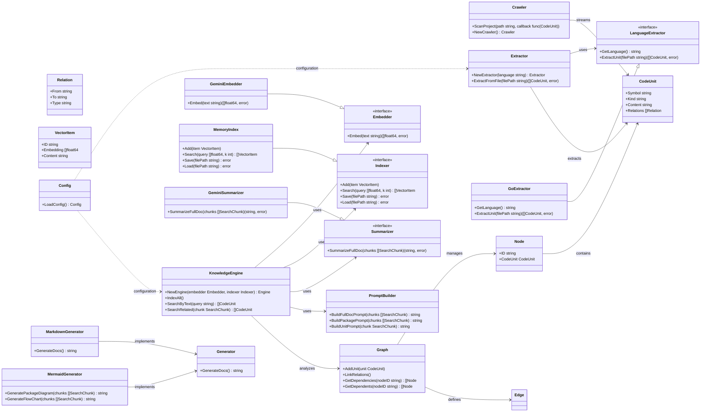

# Project Documentation

Auto-generated by `docod`.

## SECTION 1: OVERVIEW & ARCHITECTURE

### High-Level Architecture

This system employs a **Pipeline Architecture**, where data flows sequentially through distinct processing stages. Raw source code is first **crawled**, then **extracted** into a structured format, enriched with semantic understanding via **embedding**, stored and queried in a **knowledge index**, and finally, used to **generate documentation**. This modular design allows for clear separation of concerns and facilitates extensibility with support for new languages or knowledge processing techniques.

### Core Concepts

*   **CodeUnit**: The fundamental building block representing any extracted code symbol (e.g., function, variable, struct, interface). It serves as a universal container for code elements and their metadata.
*   **Relation**: Defines a directed link between `CodeUnit`s, representing dependencies, calls, or other forms of code relationships. These relations are crucial for building the dependency graph.
*   **LanguageExtractor**: An interface defining the contract for language-specific parsers. Each implementation handles the intricacies of a particular programming language to extract `CodeUnit`s and `Relation`s.
*   **Knowledge Engine**: Orchestrates the semantic understanding and retrieval of code information. It leverages embedders to convert code into vector representations and an indexer for efficient search and querying.

### Mermaid Diagram



## SECTION 2: KEY FEATURES

### Code Extraction

*   **Concept**: Automatically parses source code files to identify and extract meaningful code symbols like functions, variables, types, and interfaces. This is the foundational step for understanding the project's structure and content.
*   **Implementation**: The system uses a `Crawler` to traverse the project directory and a language-specific `Extractor`. The `Extractor` utilizes a `LanguageExtractor` (e.g., `GoExtractor` for Go code) to parse individual files. Each `LanguageExtractor` implements the `LanguageExtractor` interface, defining methods to get the language and extract code units. The extracted information is stored as `CodeUnit` structs, which are universal containers for code symbols.
*   **Usage**:
    ```go
    import (
        "your_module_path/extractor"
    )

    // ...

    langExtractor := extractor.NewExtractor("go") // Or other supported languages
    codeUnits, err := langExtractor.ExtractFromFile("path/to/your/file.go")
    if err != nil {
        // Handle error
    }
    for _, unit := range codeUnits {
        // Process each CodeUnit (e.g., print its name and kind)
        fmt.Printf("Extracted: %s (%s)\n", unit.Symbol, unit.Kind)
    }
    ```

### Semantic Indexing and Search

*   **Concept**: Builds a knowledge base of code by converting extracted code units into vector embeddings and storing them in an index. This allows for semantic searching, enabling users to find code snippets based on their meaning rather than exact keywords. It also supports graph-aware searches for related code.
*   **Implementation**: The `KnowledgeEngine` orchestrates this feature. It uses an `Embedder` (like `GeminiEmbedder`) to convert code text into numerical vectors. These `VectorItem`s are then stored in an `Indexer` (like `MemoryIndex`). The `MemoryIndex` provides both vector similarity search and graph proximity search by leveraging the dependency graph information. The `IndexAll` method processes all graph nodes, and `SearchByText` performs semantic search.
*   **Usage**:
    ```go
    import (
        "your_module_path/knowledge"
        // ... other imports
    )

    // Assuming 'engine' is an initialized KnowledgeEngine
    // with a configured Embedder and Indexer.
    // For example:
    // embedder := knowledge.NewGeminiEmbedder("[REDACTED]")
    // indexer := knowledge.NewMemoryIndex(embedder)
    // engine := knowledge.NewEngine(indexer, nil) // Pass graph if available

    searchResults, err := engine.SearchByText("function to parse JSON")
    if err != nil {
        // Handle error
    }
    for _, unit := range searchResults {
        fmt.Printf("Found: %s in %s\n", unit.Symbol, unit.File)
    }
    ```

### Documentation Generation

*   **Concept**: Automatically generates comprehensive documentation in various formats (e.g., Markdown, Mermaid diagrams) from the extracted and indexed code knowledge. This streamlines the documentation process and ensures up-to-date, accurate documentation.
*   **Implementation**: The system provides `MarkdownGenerator` and `MermaidGenerator`. The `MarkdownGenerator`'s `GenerateDocs` method iterates through the project's dependency graph and assembled code units to produce a single Markdown file. The `MermaidGenerator` can create package diagrams and flowcharts using `GeneratePackageDiagram` and `GenerateFlowChart` methods, which take structured code knowledge chunks as input. A `PromptBuilder` is used to construct prompts for LLMs when generating summaries or more complex documentation elements.
*   **Usage**:
    ```go
    import (
        "your_module_path/generator"
        // ... other imports
    )

    // Assuming 'graph' contains the project's dependency graph
    // and 'engine' has indexed the code.

    // Generate Markdown documentation
    mdGenerator := generator.NewMarkdownGenerator()
    markdownDocs, err := mdGenerator.GenerateDocs(graph) // Pass graph or other relevant data
    if err != nil {
        // Handle error
    }
    fmt.Println("--- Markdown Documentation ---")
    fmt.Println(markdownDocs)

    // Generate a Mermaid package diagram (example, requires suitable data)
    // mermaidGen := generator.NewMermaidGenerator()
    // packageDiagram, err := mermaidGen.GeneratePackageDiagram(relevantChunks) // Assuming relevantChunks are prepared
    // if err != nil {
    //     // Handle error
    // }
    // fmt.Println("--- Mermaid Package Diagram ---")
    // fmt.Println(packageDiagram)
    ```

### Hierarchical Summarization

*   **Concept**: Leverages Large Language Models (LLMs) to generate hierarchical summaries of code, providing different levels of detail from individual units to entire packages or the whole document. This aids in quickly understanding complex codebases at various abstraction levels.
*   **Implementation**: The `GeminiSummarizer` implements the `Summarizer` interface, utilizing Google's Gemini Pro. It works in conjunction with the `KnowledgeEngine` and `PromptBuilder`. The `SummarizeFullDoc` method, for instance, likely uses `PromptBuilder` to create context-rich prompts based on extracted code chunks and then sends these to the Gemini API for summarization.
*   **Usage**:
    ```go
    import (
        "your_module_path/knowledge"
        // ... other imports
    )

    // Assuming 'engine' is an initialized KnowledgeEngine
    // and 'knowledgeGraph' is populated.

    // Prepare chunks for summarization (this step might be internal to Engine or explicit)
    // For example:
    // chunks := engine.PrepareSearchChunks(knowledgeGraph.GetAllNodes())

    // Initialize the summarizer
    summarizer := knowledge.NewGeminiSummarizer("[REDACTED]") // Replace with your Gemini API key

    // Summarize the entire document/project
    fullDocSummary, err := summarizer.SummarizeFullDoc(chunks) // 'chunks' should be []knowledge.SearchChunk
    if err != nil {
        // Handle error
    }
    fmt.Println("--- Full Document Summary ---")
    fmt.Println(fullDocSummary)
    ```

## Updating Documentation Automatically

This feature provides an automated mechanism to update documentation based on code changes. It identifies modified or new code files, analyzes their impact on existing documentation, and either updates relevant sections or generates new ones.

### Concept

The automatic documentation updater works by:

1.  **Parsing and Indexing**: It first parses the existing Markdown documentation into sections and then indexes these sections as searchable `doc_section` type `VectorItem`s.
2.  **Analyzing Code Changes**: When code files are changed or added, the system generates `SearchChunk`s for these files. These chunks are then embedded into vectors.
3.  **Semantic Search**: The embedded code chunks are used to perform semantic searches against the indexed documentation sections. This identifies which existing documentation sections are semantically related to the code changes.
4.  **Generating or Updating Content**:
    *   If relevant existing documentation sections are found, the system prompts an LLM to update them with the new information from the code.
    *   If new code files are introduced without clear corresponding documentation, the system can generate entirely new documentation sections.
5.  **Applying Changes**: The generated or updated documentation content is then applied as a "patch" to the original document.

### Usage

To utilize the automatic documentation updater, you typically integrate it into your development workflow. This might involve:

*   **Triggering the Update**: The update process can be triggered manually or automatically (e.g., via a pre-commit hook or a CI/CD pipeline).
*   **Specifying the Documentation File**: You need to provide the path to the main documentation file (e.g., `README.md`).
*   **Providing Changed Files**: A list of changed, added, or deleted file paths needs to be supplied.

The updater will then:

1.  Read the existing documentation.
2.  Parse it into manageable sections.
3.  Index these documentation sections.
4.  Process the provided changed files, creating embeddings for them.
5.  Search for relevant documentation sections using these embeddings.
6.  Generate or update documentation content based on the search results.
7.  Output the updated documentation content.

### Example

Imagine you have a `README.md` file and you've just added a new feature in `pkg/new_feature.go`. The following conceptual steps would be involved:

1.  **Initial State**: Your `README.md` exists, and `pkg/new_feature.go` is a new file.
2.  **Code Change**: You commit `pkg/new_feature.go`. A Git hook or CI process detects this change.
3.  **Update Trigger**: The `UpdateDocs` function is called with the path to `README.md` and `["pkg/new_feature.go"]` as changed files.
4.  **Processing `pkg/new_feature.go`**:
    *   The file is converted into a `SearchChunk`.
    *   This chunk is embedded into a vector.
    *   A semantic search is performed against the indexed sections of `README.md`.
5.  **Outcome**:
    *   **Scenario A (New Section Needed)**: If no existing section in `README.md` semantically matches the new feature, the system might use a prompt like `BuildNewSectionPrompt` to generate a new markdown section for `pkg/new_feature.go`.
    *   **Scenario B (Existing Section Update)**: If an existing section (e.g., "Features") is found to be related, the system might use a prompt like `UpdateDocSection` to update that section with details from `pkg/new_feature.go`.
6.  **Output**: The function returns the complete, updated `README.md` content, which can then be committed.

This automated process ensures that your documentation stays synchronized with your codebase, reducing manual effort and the risk of outdated information.

## SECTION 3: DEVELOPMENT GUIDE

### Quick Start

**Prerequisites**:

*   Go version 1.18 or higher
*   Access to Google Gemini API (if using Gemini-based embedders/summarizers)

**Run Commands**:

1.  **Clone the repository**:
    ```bash
    git clone <repository_url>
    cd <repository_directory>
    ```

2.  **Install Dependencies**:
    ```bash
    go mod tidy
    ```

3.  **Set Environment Variables**:
    Ensure your Google Gemini API key is set. Refer to the Configuration section for details.

4.  **Build and Run**:
    To run the core logic (e.g., crawling, extracting, indexing, generating docs):
    ```bash
    go run main.go <your_project_path>
    ```
    Replace `<your_project_path>` with the path to the Go project you want to analyze.

### Configuration

Configuration for the system can be managed through environment variables. This allows for flexible deployment and integration into CI/CD pipelines.

*   **`GEMINI_API_KEY`**:
    *   **Description**: This environment variable is required when using the `GeminiEmbedder` or `GeminiSummarizer` to authenticate with the Google Gemini API.
    *   **Usage**: Set this variable before running the application.
    *   **Example**:
        ```bash
        export GEMINI_API_KEY="YOUR_GEMINI_API_KEY"
        go run main.go <your_project_path>
        ```
    *   **Note**: Ensure you replace `"YOUR_GEMINI_API_KEY"` with your actual API key. This key should be treated as a secret and not committed to version control. The code itself will redact this value when logging or displaying configurations.

*   **`CONFIG_PATH` (Optional)**:
    *   **Description**: Specifies a path to a custom configuration file if the system were to support file-based configuration in the future. Currently, environment variables are the primary mechanism.
    *   **Usage**: If implemented, you would set this variable to point to your configuration file.
    *   **Example**:
        ```bash
        export CONFIG_PATH="/path/to/your/config.yaml"
        go run main.go <your_project_path>
        ```
    *   **Note**: As of the provided context, this variable might not be actively used but is included for potential future expansion. The `LoadConfig` function in `config.go` is the entry point for configuration loading.

## In-Memory Index with Graph Awareness

This module provides an in-memory implementation of a vector index (`MemoryIndex`) designed for efficient storage and retrieval of code embeddings. It integrates with a graph structure to enable hybrid search, combining vector similarity with graph-based proximity.

### Concept

The `MemoryIndex` stores `VectorItem`s, which consist of a `SearchChunk` (representing a piece of code) and its corresponding embedding (a `[]float32` vector). It uses a hash-based cache (`hashes`) for quick lookups of existing chunks by their IDs and maintains a list of all stored items (`items`).

The key differentiator of `MemoryIndex` is its awareness of a graph structure (presumably a code dependency graph). While the provided code snippet for `MemoryIndex` itself doesn't explicitly show graph traversal, its usage within the `knowledge.Engine` suggests that search operations can leverage graph relationships for more contextually relevant results.

### Usage

The `MemoryIndex` can be initialized using `NewMemoryIndex`, which requires a `graph.Graph` object.

-   **Loading and Saving**: The index supports persistence to and from files using the `Save` and `Load` methods, respectively. This allows the index to be reconstituted across application runs.
-   **Adding Items**: New code chunks and their embeddings can be added using the `Add` method.
-   **Deleting Items**: Items can be removed from the index by their IDs using the `Delete` method.
-   **Searching**: The `Search` method performs a hybrid search, leveraging both vector similarity and graph proximity to find the most relevant `VectorItem`s for a given query vector.

### Example

```go
package main

import (
	"context"
	"fmt"

	"your_module_path/graph" // Assuming graph package is available
	"your_module_path/knowledge" // Assuming knowledge package is available
)

func main() {
	// Assume graph and embedder are initialized elsewhere
	g := graph.NewGraph() // Initialize your graph
	// Populate graph with nodes and relations as needed...

	// Initialize Gemini embedder. Replace "YOUR_API_KEY" with your actual API key.
	embedder, err := knowledge.NewGeminiEmbedder(context.Background(), "YOUR_API_KEY", "models/text-embedding-004", 768)
	if err != nil {
		fmt.Printf("Error creating embedder: %v\n", err)
		return
	}

	// Initialize the MemoryIndex with the graph
	index := knowledge.NewMemoryIndex(g)

	// Example: Creating and adding a VectorItem
	chunk := knowledge.SearchChunk{
		ID:          "unique-chunk-id-123",
		Name:        "MyFunction",
		Description: "A sample function.",
		Content:     "func MyFunction() {}",
		UnitType:    "function",
		Package:     "main",
	}
	// Note: In a real scenario, the embedding would be generated by the embedder.
	// For demonstration, a placeholder is used here.
	embedding := make([]float32, embedder.Dimension()) // Get dimension from embedder
	// Example: embedding would be generated by embedder.Embed(ctx, chunk.Content)

	vecItem := knowledge.VectorItem{
		Chunk:     chunk,
		Embedding: embedding,
	}

	err = index.Add(context.Background(), []knowledge.VectorItem{vecItem})
	if err != nil {
		fmt.Printf("Error adding item to index: %v\n", err)
		return
	}
	fmt.Println("Item added to index.")

	// Example: Searching the index
	queryVector := make([]float32, embedder.Dimension()) // Query vector should match embedding dimension
	// Example: queryVector would be generated by embedder.Embed(ctx, "query string")
	topK := 5
	results, err := index.Search(context.Background(), queryVector, topK)
	if err != nil {
		fmt.Printf("Error searching index: %v\n", err)
		return
	}

	fmt.Printf("Found %d search results:\n", len(results))
	for i, res := range results {
		fmt.Printf("%d. Chunk ID: %s, Name: %s\n", i+1, res.Chunk.ID, res.Chunk.Name)
	}
}
```

