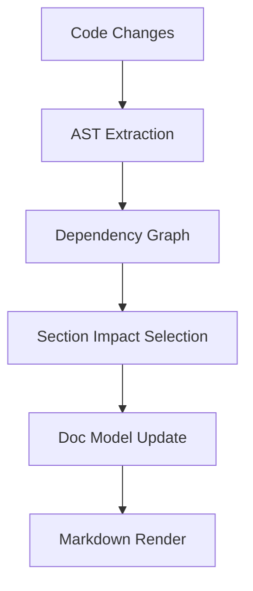

# Project Documentation

Auto-generated by `docod`.

# Overview

## Purpose

`docod` provides incremental documentation for evolving codebases.
It focuses on keeping official technical docs aligned with code changes while minimizing manual effort.

## Architecture

`docod` builds a code graph from parsed symbols and uses that graph to determine impacted documentation sections.
For semantic writing tasks, generation is scoped to selected sections only.

## System Diagram



# Key Features

## Incremental Section Updates

Only impacted sections should be updated on each sync, instead of regenerating the entire document.

### Example

```bash
docod sync
```

## Model-Driven Documentation

`docs/doc_model.json` is the source of truth for section structure and ordering.
`docs/documentation.md` is rendered from the model.

### Example

```bash
docod sync --help
```

# Development

## Quick Start

1. Configure `config.yaml`.
2. Run `docod sync`.
3. Review generated markdown changes.

## Configuration Notes

- Keep API keys in environment variables.
- Tune `docs.max_llm_sections` to control generation cost.
- Enable optional routing features only when needed.
